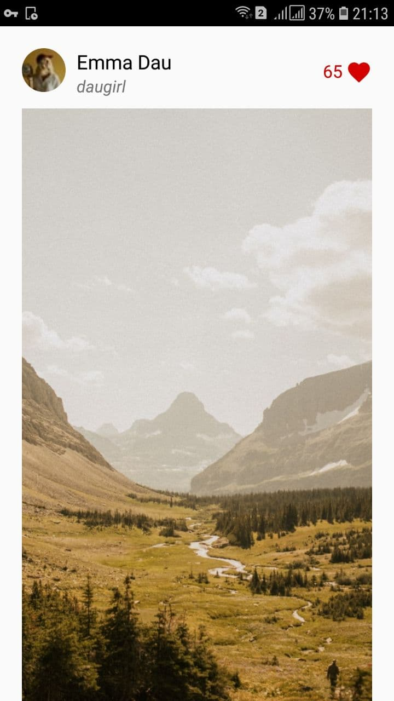
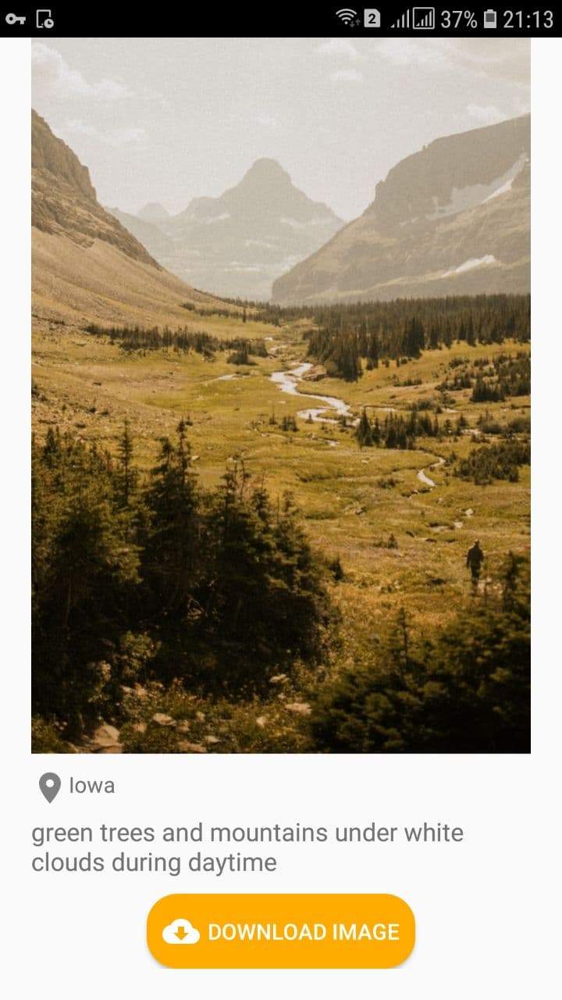

# UnsplashProject
An app that allows to view, search, download high-quality photos using Unsplash API

Separation of concerns, high level of abstraction and the dependency rule, which in our case means that layers only know about what's directly underneath them:

* Presentation layer knows about use cases (domain layer).
* Domain layer knows about repository (data layer) but not the Presentation layer.
* Data layer doesn't know about domain or presentation layers.

This allows for easier testing and maintenance and recommended for bigger projects (alongside modularization).
## Tech Stack
* Architecture: MVVM, Clean Architecture 
* [Kotlin Coroutines][1] for managing background threads with simplified code and reducing needs for callbacks
* [Koin][2] as dependency injection
* [Paging Library][3] helps you load and display small chunks of data at a time. Loading partial data on demand reduces usage of network bandwidth and system resources.
* Network: [Retrofit][4] in order to simplify requesting data from REST API
* A presentation layer that contains a fragment (View) and a ViewModel per screen (or feature).
* A data layer with a repository and two data sources (local using Room and remote using Retrofit)
* [LiveData][5] - Build data objects that notify views when the underlying database changes.
* [Room][6] - Access your app's SQLite database with in-app objects and compile-time checks.
* [ViewModel][7] - Store UI-related data that isn't destroyed on app rotations. Easily schedule
     asynchronous tasks for optimal execution.
     
[1]: https://kotlinlang.org/docs/reference/coroutines-overview.html
[2]: https://insert-koin.io/
[3]: https://developer.android.com/topic/libraries/architecture/paging
[4]: https://square.github.io/retrofit/
[5]: https://developer.android.com/topic/libraries/architecture/livedata
[6]: https://developer.android.com/topic/libraries/architecture/room
[7]: https://developer.android.com/topic/libraries/architecture/viewmodel

## Screenshots

     

