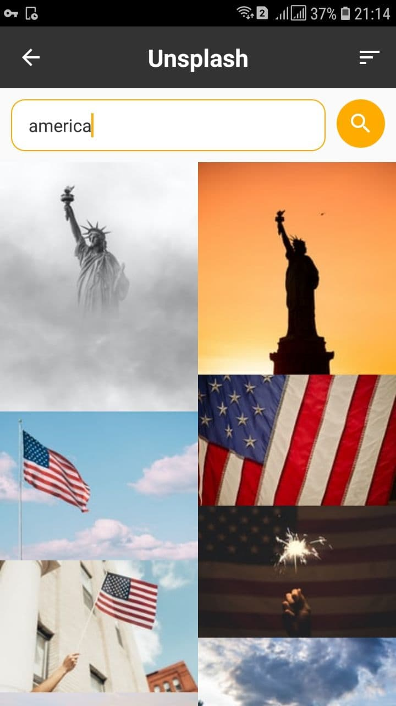

# UnsplashProject
An app that allows to view, search, download high-quality photos using Unsplash API
## Applied concepts
* Arch. patterns: MVVM, Clean Architecture 
* DI: Koin
* Paging
* Network: Retrofit
* Multithreading: Coroutines
* DB: Room

## Screenshots

     

